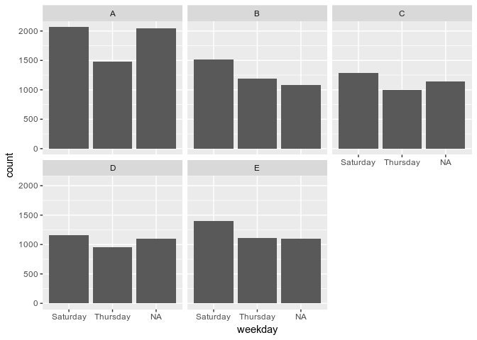

# Practical Machine Learning Week 4 Final Project
Joseph S. Tabadero, Jr.  
October 7, 2017  


# Introduction

## Background

Using devices such as Jawbone Up, Nike FuelBand, and Fitbit it is now possible to collect a large amount of data about personal activity relatively inexpensively. These type of devices are part of the quantified self movement - a group of enthusiasts who take measurements about themselves regularly to improve their health, to find patterns in their behavior, or because they are tech geeks. One thing that people regularly do is quantify how much of a particular activity they do, but they rarely quantify how well they do it. In this project, your goal will be to use data from accelerometers on the belt, forearm, arm, and dumbell of 6 participants. They were asked to perform barbell lifts correctly and incorrectly in 5 different ways. More information is available from the website here: http://groupware.les.inf.puc-rio.br/har (see the section on the Weight Lifting Exercise Dataset).

## Data

The training data for this project are available here: https://d396qusza40orc.cloudfront.net/predmachlearn/pml-training.csv

The test data are available here: https://d396qusza40orc.cloudfront.net/predmachlearn/pml-testing.csv

The data for this project come from this source: http://groupware.les.inf.puc-rio.br/har.

## Objective

The goal of your project is to predict the manner in which they did the exercise. This is the “classe” variable in the training set. 

# Downloading the Data Set


```r
# Download the training and test sets
if(!file.exists("pml-training.csv")){
trainingUrl <- "https://d396qusza40orc.cloudfront.net/predmachlearn/pml-training.csv"
testUrl <- "https://d396qusza40orc.cloudfront.net/predmachlearn/pml-testing.csv"
download.file(trainingUrl, destfile = "pml-training.csv", method="curl")
download.file(testUrl, destfile = "pml-testing.csv", method="curl")
}

# import the data sets
training <- read.csv("pml-training.csv")
testing <- read.csv("pml-testing.csv")
dim(training)
```

```
## [1] 19622   160
```

## Data Transformation


```r
# loading the required packages
library(lubridate)
library(caret)
```


```r
training$cvtd_timestamp <- as.Date(training$cvtd_timestamp, format = "%m/%d/%Y %H:%M")
training$weekday <- weekdays(training$cvtd_timestamp)
training$weekdayf <- factor(training$weekday)
```

## Exploratory Data Analysis


```r
table(training$classe) 
```

```
## 
##    A    B    C    D    E 
## 5580 3797 3422 3216 3607
```

```r
prop.table(table(training$classe))
```

```
## 
##              A              B              C              D              E 
## 0.284374681480 0.193507287738 0.174396086026 0.163897665885 0.183824278871
```

```r
prop.table(table(training$user_name))
```

```
## 
##         adelmo       carlitos        charles         eurico         jeremy 
## 0.198348792172 0.158597492610 0.180205891346 0.156457038019 0.173376821935 
##          pedro 
## 0.133013963918
```

```r
ggplot(training, aes(weekday)) +
  geom_bar() +
  facet_wrap(~classe, ncol = 3)
```

<!-- -->

## Data Cleaning


```r
## Remove columns with missing values
training <- training[, colSums(is.na(training)) == 0]
testing <- testing[, colSums(is.na(testing)) == 0] 

## Remove columns that are not relevant to accelerometer measurements.
classe<- training$classe
trainRemove<- grepl("^X|timestamp|window", names(training))
training2 <- training[, !trainRemove]
trainCleaned<- training2[, sapply(training2, is.numeric)]
trainCleaned$classe<- classe
testRemove<- grepl("^X|timestamp|window", names(testing))
testing2 <- testing[, !testRemove]
testCleaned<- training2[, sapply(testing2, is.numeric)]
testCleaned <- testCleaned[, c(names(intersect(trainCleaned, testCleaned)))]
dim(trainCleaned)
```

```
## [1] 19622    53
```
We now have 52 predictors left from the original 91 predictors. This still seem to be a lot, but we already have a sizeable reduction from the original.


## Create a partition of the training data set for training models


```r
set.seed(626)
library(caret)
inTrain <- createDataPartition(trainCleaned$classe, p=0.70, list=F)
trainData <- trainCleaned[inTrain, ]
testData <- trainCleaned[-inTrain, ]
```

## Modeling

Here I consider decision trees, random forests, and generalized boosted regression, with 5 cross-validations. I shall choose the best model by comparing the in-sample predictive accuracy.

### Decision Trees


```r
fitControl <- trainControl(## 10-fold CV
                           method = "cv",
                           number = 5)
dtmod <- train(classe~., data=trainData, method="rpart", trControl=fitControl)
dtmod
```

```
## CART 
## 
## 13737 samples
##    52 predictor
##     5 classes: 'A', 'B', 'C', 'D', 'E' 
## 
## No pre-processing
## Resampling: Cross-Validated (5 fold) 
## Summary of sample sizes: 10990, 10990, 10988, 10989, 10991 
## Resampling results across tuning parameters:
## 
##   cp               Accuracy        Kappa          
##   0.0346861967246  0.503678832507  0.3519294041129
##   0.0599125216153  0.467439740527  0.2947893868087
##   0.1151459668396  0.331502973432  0.0718037567986
## 
## Accuracy was used to select the optimal model using  the largest value.
## The final value used for the model was cp = 0.0346861967246.
```


```r
predictiondt <- predict(dtmod, testData)
cmdt <- confusionMatrix(predictiondt, testData$classe)
cmdt
```

```
## Confusion Matrix and Statistics
## 
##           Reference
## Prediction    A    B    C    D    E
##          A 1533  503  480  420  152
##          B   21  387   31  183  143
##          C  116  249  515  361  298
##          D    0    0    0    0    0
##          E    4    0    0    0  489
## 
## Overall Statistics
##                                                     
##                Accuracy : 0.496856415               
##                  95% CI : (0.484001405, 0.509714542)
##     No Information Rate : 0.284451997               
##     P-Value [Acc > NIR] : < 2.220446e-16            
##                                                     
##                   Kappa : 0.341941307               
##  Mcnemar's Test P-Value : NA                        
## 
## Statistics by Class:
## 
##                         Class: A     Class: B     Class: C    Class: D
## Sensitivity          0.915770609 0.3397717296 0.5019493177 0.000000000
## Specificity          0.630729043 0.9203539823 0.7892570488 1.000000000
## Pos Pred Value       0.496437824 0.5058823529 0.3346328785         NaN
## Neg Pred Value       0.949588845 0.8531250000 0.8824206167 0.836193713
## Prevalence           0.284451997 0.1935429057 0.1743415463 0.163806287
## Detection Rate       0.260492778 0.0657604078 0.0875106202 0.000000000
## Detection Prevalence 0.524723874 0.1299915038 0.2615123195 0.000000000
## Balanced Accuracy    0.773249826 0.6300628559 0.6456031833 0.500000000
##                          Class: E
## Sensitivity          0.4519408503
## Specificity          0.9991671872
## Pos Pred Value       0.9918864097
## Neg Pred Value       0.8900222552
## Prevalence           0.1838572642
## Detection Rate       0.0830926083
## Detection Prevalence 0.0837723025
## Balanced Accuracy    0.7255540187
```

### Random Forests


```r
controlRf <- trainControl(method="cv", 5)
rfmod<- train(classe ~., data=trainData, method="rf", trControl=controlRf, importance=TRUE, ntree=100)
rfmod
```

```
## Random Forest 
## 
## 13737 samples
##    52 predictor
##     5 classes: 'A', 'B', 'C', 'D', 'E' 
## 
## No pre-processing
## Resampling: Cross-Validated (5 fold) 
## Summary of sample sizes: 10989, 10991, 10990, 10989, 10989 
## Resampling results across tuning parameters:
## 
##   mtry  Accuracy        Kappa         
##    2    0.990390521968  0.987842712220
##   27    0.990900221902  0.988487978714
##   52    0.981873648247  0.977068601720
## 
## Accuracy was used to select the optimal model using  the largest value.
## The final value used for the model was mtry = 27.
```


```r
predictionRf <- predict(rfmod, testData)
cmRf <- confusionMatrix(predictionRf, testData$classe)
cmRf
```

```
## Confusion Matrix and Statistics
## 
##           Reference
## Prediction    A    B    C    D    E
##          A 1671    9    0    0    0
##          B    3 1125    4    0    0
##          C    0    5 1021    8    3
##          D    0    0    1  955    2
##          E    0    0    0    1 1077
## 
## Overall Statistics
##                                                     
##                Accuracy : 0.993882753               
##                  95% CI : (0.991541116, 0.995711985)
##     No Information Rate : 0.284451997               
##     P-Value [Acc > NIR] : < 2.220446e-16            
##                                                     
##                   Kappa : 0.992261581               
##  Mcnemar's Test P-Value : NA                        
## 
## Statistics by Class:
## 
##                         Class: A    Class: B    Class: C    Class: D
## Sensitivity          0.998207885 0.987708516 0.995126706 0.990663900
## Specificity          0.997862740 0.998525074 0.996707141 0.999390368
## Pos Pred Value       0.994642857 0.993816254 0.984570878 0.996868476
## Neg Pred Value       0.999286564 0.997054492 0.998968647 0.998173331
## Prevalence           0.284451997 0.193542906 0.174341546 0.163806287
## Detection Rate       0.283942226 0.191163976 0.173491929 0.162276975
## Detection Prevalence 0.285471538 0.192353441 0.176210705 0.162786746
## Balanced Accuracy    0.998035313 0.993116795 0.995916924 0.995027134
##                         Class: E
## Sensitivity          0.995378928
## Specificity          0.999791797
## Pos Pred Value       0.999072356
## Neg Pred Value       0.998959850
## Prevalence           0.183857264
## Detection Rate       0.183007647
## Detection Prevalence 0.183177570
## Balanced Accuracy    0.997585362
```

### GBM


```r
fitControl <- trainControl(## 10-fold CV
                           method = "cv",
                           number = 5)
gbmod <- train(classe~., data=trainData, method="gbm",
               trControl = fitControl,
               verbose = FALSE)
```


```r
gbmod
```

```
## Stochastic Gradient Boosting 
## 
## 13737 samples
##    52 predictor
##     5 classes: 'A', 'B', 'C', 'D', 'E' 
## 
## No pre-processing
## Resampling: Cross-Validated (5 fold) 
## Summary of sample sizes: 10989, 10990, 10989, 10991, 10989 
## Resampling results across tuning parameters:
## 
##   interaction.depth  n.trees  Accuracy        Kappa         
##   1                   50      0.756060879580  0.690382339452
##   1                  100      0.818083340851  0.769667711318
##   1                  150      0.852370422684  0.813167362923
##   2                   50      0.855646565331  0.817078461258
##   2                  100      0.905075400997  0.879869187478
##   2                  150      0.931718335303  0.913591389295
##   3                   50      0.895977027644  0.868302518587
##   3                  100      0.942564599687  0.927321673771
##   3                  150      0.959962566621  0.949345348560
## 
## Tuning parameter 'shrinkage' was held constant at a value of 0.1
## 
## Tuning parameter 'n.minobsinnode' was held constant at a value of 10
## Accuracy was used to select the optimal model using  the largest value.
## The final values used for the model were n.trees = 150,
##  interaction.depth = 3, shrinkage = 0.1 and n.minobsinnode = 10.
```


```r
predictiongb <- predict(gbmod, testData)
cmgb <- confusionMatrix(predictiongb, testData$classe)
cmgb
```

```
## Confusion Matrix and Statistics
## 
##           Reference
## Prediction    A    B    C    D    E
##          A 1648   41    0    3    2
##          B   15 1057   37    2    9
##          C    5   40  978   28    7
##          D    5    1    9  922   16
##          E    1    0    2    9 1048
## 
## Overall Statistics
##                                                    
##                Accuracy : 0.96057774               
##                  95% CI : (0.955287447, 0.96540494)
##     No Information Rate : 0.284451997              
##     P-Value [Acc > NIR] : < 2.220446e-16           
##                                                    
##                   Kappa : 0.950117405              
##  Mcnemar's Test P-Value : 7.97537405e-06           
## 
## Statistics by Class:
## 
##                         Class: A    Class: B    Class: C    Class: D
## Sensitivity          0.984468339 0.928007024 0.953216374 0.956431535
## Specificity          0.989076229 0.986725664 0.983535707 0.993700467
## Pos Pred Value       0.972845336 0.943750000 0.924385633 0.967471144
## Neg Pred Value       0.993796230 0.982791186 0.990055935 0.991484185
## Prevalence           0.284451997 0.193542906 0.174341546 0.163806287
## Detection Rate       0.280033985 0.179609176 0.166185217 0.156669499
## Detection Prevalence 0.287850467 0.190314359 0.179779099 0.161937128
## Balanced Accuracy    0.986772284 0.957366344 0.968376041 0.975066001
##                         Class: E
## Sensitivity          0.968576710
## Specificity          0.997501562
## Pos Pred Value       0.988679245
## Neg Pred Value       0.992953368
## Prevalence           0.183857264
## Detection Rate       0.178079864
## Detection Prevalence 0.180118946
## Balanced Accuracy    0.983039136
```


# Conclusion

Random Forests gave the highest accuracy (99.39%) when compared to decision trees and generalized boosted regression. The expected out-of-sample error using random forests is 0.61%.

# Predicting on out-of-sample validation set


```r
prediction <- predict(rfmod, testing)
prediction
```

```
##  [1] B A B A A E D B A A B C B A E E A B B B
## Levels: A B C D E
```

```r
write.table(prediction, "predictions.txt", row.names = FALSE, col.names = FALSE)
```

